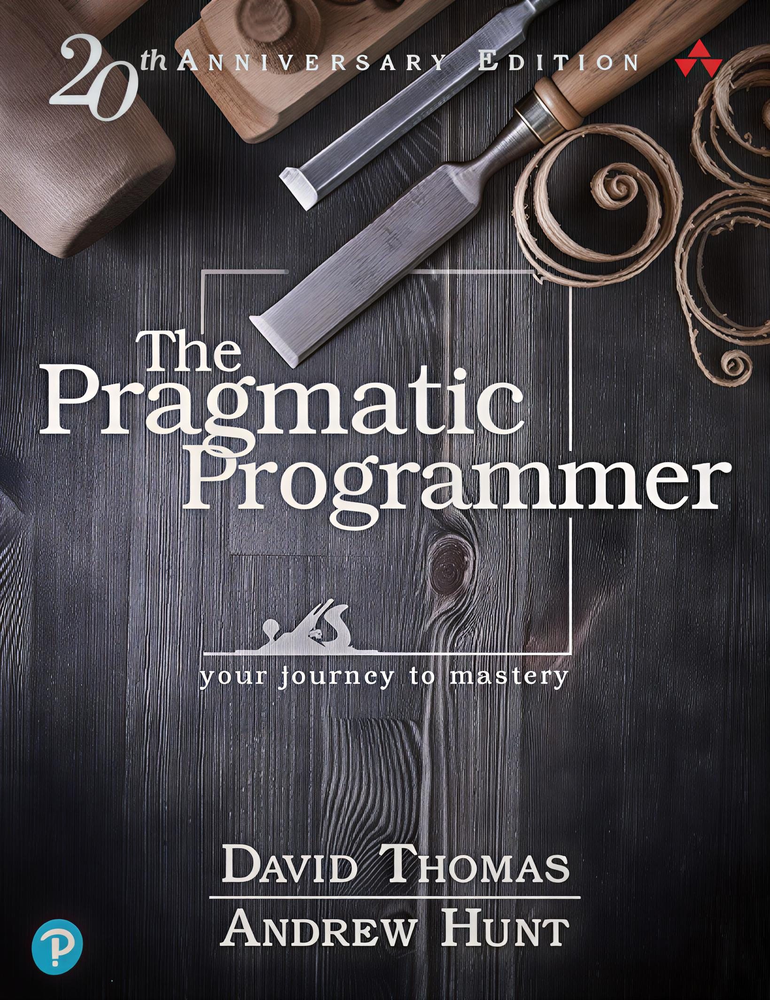

  

<h1 align="center"> ترجمه فارسی کتاب The Pragmatic Programmer</h1>

  راهنمایی برای تبدیل شدن از «کارجو» به «استادکار» در دنیای واقعی برنامه‌نویسی

  
  
  
  
  

<h1>

   <a href="https://hheydarian.github.io/Gitab/" target="_blank"><strong>  گیتاب — نسخه آنلاین ترجمه </strong></a>

</h1>

---

## ✨ معرفی پروژه

کتاب **The Pragmatic Programmer** نوشتهٔ **Andrew Hunt** و **David Thomas** یکی از تأثیرگذارترین کتاب‌ها در تاریخ مهندسی نرم‌افزار است.  
این اثر، نه صرفاً دربارهٔ کدنویسی، بلکه دربارهٔ طرز تفکر، تصمیم‌گیری و حرفه‌ای زیستنِ یک برنامه‌نویس است.  

این ریپازیتوری تلاشی است برای ارائهٔ نسخه‌ای فارسی، دقیق و خوانا از این کتاب ماندگار برای جامعهٔ برنامه‌نویسان فارسی‌زبان.  
هدف ما، ترجمه‌ای وفادار اما امروزی است که به رشد فکری و حرفه‌ای توسعه‌دهندگان کمک کند 🚀

---

## ⚙️ پیش‌نیاز مطالعه

🔹 آشنایی پایه با یک زبان برنامه‌نویسی کافی است — تمرکز این کتاب بر «تفکر نرم‌افزاری» است، نه صرفاً کد.  
🔹 برای تجربهٔ بهتر در مرورگر، پیشنهاد می‌کنیم افزونه [فونت ایران](https://chromewebstore.google.com/detail/fontiran/edbchgkbejkdkdkpgenlaciegoidmjoh) را نصب کنید.

---

## 🙌 راه‌های مشارکت

ما از حضور شما در این پروژه استقبال می‌کنیم. می‌توانید از این راه‌ها مشارکت کنید:

- ✏️ **بازبینی ترجمه و پیشنهاد بهبود متن**
- 💬 **افزودن توضیحات فرهنگی یا فنی برای بومی‌سازی بهتر مفاهیم**
- 🎨 **بهبود طراحی صفحات و تصاویر**

---

## 🔗 فصل‌های کتاب (با لینک)

  
| شماره | نام فصل (انگلیسی)                        | نام فصل (فارسی)                             | وضعیت | لینک                                               |
|-------|-------------------------------------------|----------------------------------------------|--------|----------------------------------------------------|
| 00    | Foreword                                  | پیش‌گفتار                                      | ✅     | [Foreword](Book/00/chapter00.md)
| 00    | Preface to the Second Edition                                  | پیش‌گفتار ویرایش دوم                                    | ✅     | [Second-Edition](Book/00/chapter00-1.md)                     |
| 00    | Preface to the First Edition                                 | پیش‌گفتار ویرایش اول                                    | ✅     | [First-Edition](Book/00/chapter00-2.md)                     |
| 01    | A Pragmatic Philosophy                    | فلسفهٔ عملگرایانه                           | ✅     | [A-Pragmatic-Philosophy](Book/01/chapter01.md)     |
| 02    | A Pragmatic Approach                      | رویکرد عملگرایانه                           | ✅     | [A-Pragmatic-Approach](Book/02/chapter02.md)         |
| 03    | The Basic Tools                           | ابزارهای پایه                                | ✅     | [The-Basic-Tools](Book/03/chapter03.md)                   |
| 04    | Pragmatic Paranoia                        | بدگمانی هوشمندانه                            | ✅     | [Pragmatic-Paranoia](Book/04/chapter04.md)             |
| 05    | Bend or Break                             | انعطاف یا شکست                              | ✅     | [Bend-or-Break](Book/05/chapter05.md)                       |
| 06    | Concurrency                      | همزمانی                        | ✅     | [Concurrency](Book/06/chapter06.md)         |
| 07    | While You Are Coding                      | وقتی کدنویسی می‌کنید                        | ✅     | [While-You-Are-Coding](Book/07/chapter07.md)         |
| 08    | Before the Project                        | پیش از پروژه                                 | ✅     | [Before-the-Project](Book/08/chapter08.md)             |
| 09    | Pragmatic Projects                        | پروژه‌های عملگرایانه                         | ✅     | [Pragmatic-Projects](Book/09/chapter09.md)             |
| 10    | Postface                                  | پیشنویس                                     | ✅     | [Postface](Book/10/chapter10.md)                                 |
| 11    | A1                                  | کتاب‌شناسی                                    | ✅     | [A1](Book/11/chapter11.md)                                      |
| 12    | A2                                   | پاسخ‌های برای تمرین‌ها                                    | ✅     | [A2](Book/12/chapter12.md)                                      |

---

## 🧩 اصول ساختاری پروژه

- تمامی فصل‌ها با فرمت `.md` نگارش شده‌اند.  
- تصاویر و دیاگرام‌ها در پوشه‌ی `assets/image/` قرار دارند.  
- پروژه به‌صورت باز و قابل ویرایش طراحی شده تا مشارکت‌کنندگان بتوانند مستقیماً در بهبود ترجمه نقش داشته باشند.

---

## 🛡️ مجوز و حقوق نشر

<ul dir="rtl">
<li><b>حقوق نشر کتاب اصلی:</b> © Andrew Hunt و David Thomas (نشر Addison-Wesley)</li>
<li><b>متن ترجمه:</b> تحت مجوز <code>CC BY-NC-SA 4.0</code> منتشر می‌شود.</li>
<li><b>نمونه‌کدها و تمرین‌ها:</b> تحت مجوز <code>MIT License</code> منتشر شده‌اند.</li>
</ul>

---

## 🌟 قدردانی

سپاس از همهٔ کسانی که برای گسترش دانش نرم‌افزار در جامعهٔ فارسی تلاش می‌کنند.  
💬 هر مشارکت شما، قدمی در مسیر بهتر شدن این منبع ارزشمند است.

---

ساخته شده با ❤️ برای برنامه‌نویسان عملگرا

